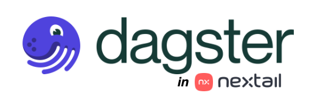
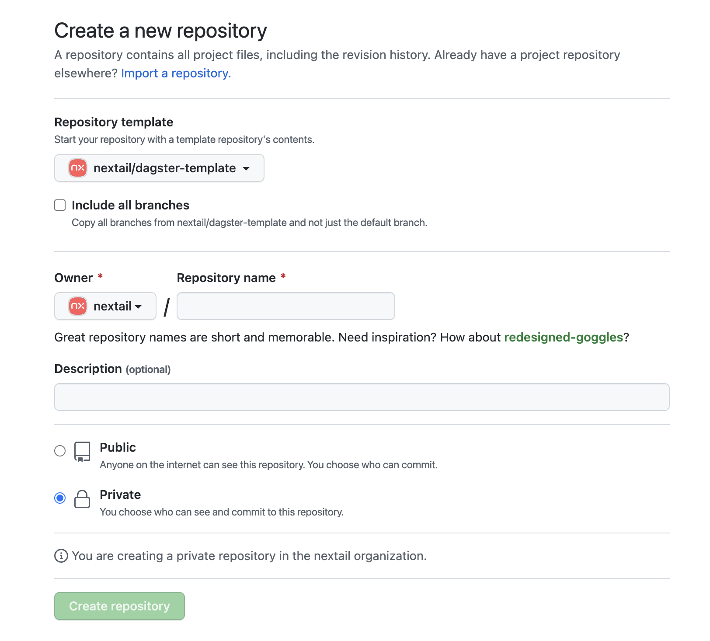
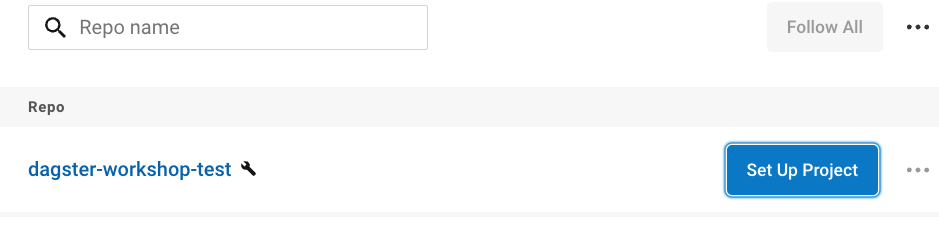
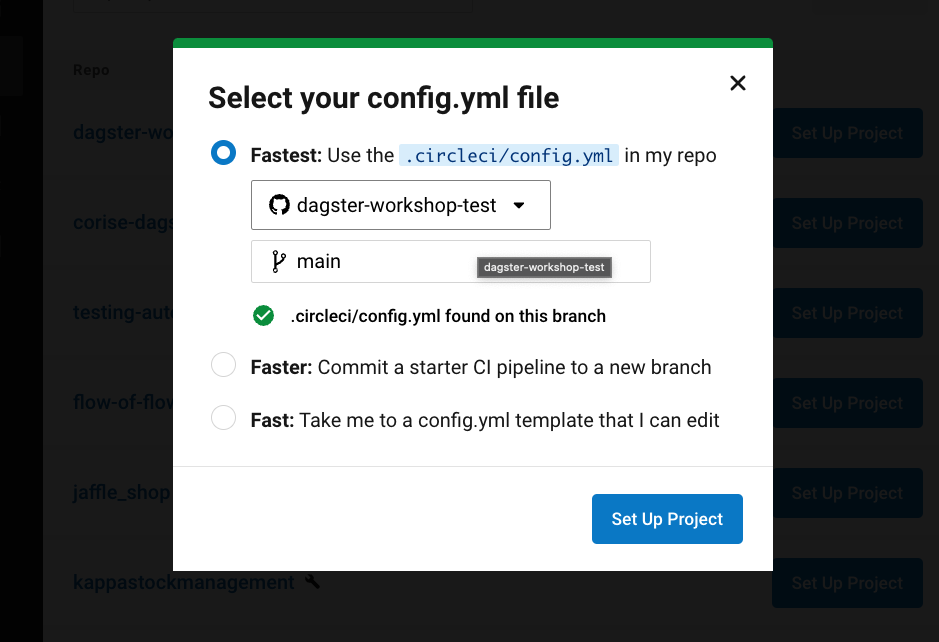
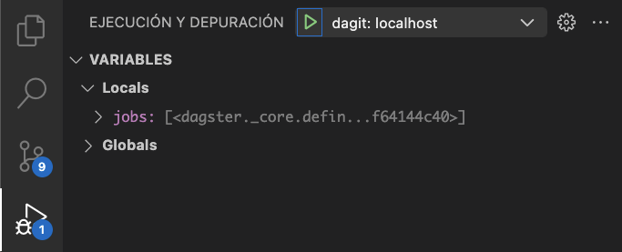

# Dagster Nextail Template [](https://dl.circleci.com/status-badge/redirect/gh/nextail/dagster-template/tree/main)


In order to make it easier to start the development in Dagster this template is provided.

This template will give us:

- A local development environment based on docker and docker-compose
- CI/CD integration with Dagster Cloud
- Examples of simple and test pipelines

## Contents

| **Name**            | **Description**                                                                       |
|---------------------|---------------------------------------------------------------------------------------|
| `.circleci/`        | CircleCI workflows                                                                    |
| `.github/`          | issue and pull request templates                                                      |
| `.platform/`        | Helm chart configuration for the project's Service Account and Secret Provider Class  |
| `.vscode/`          | Visual Studio Code custom configurations for debugging                                |
| `dagster_template/` | python package of your repository (it will change its name once you launch the update |
| `docker/`           | definition of containers on which we will develop                                     |
| `images/`           | images for the documentation                                                          |
| `scripts/`          | Utils for makefile                                                                    |
| `tests/`            | python tests for your package                                                         |
| `Makefile`          | Automating software building procedure                                                |
| `pyproject.toml`    | This file contains requirements, which are used by pdm to build the package           |
| `pdm.lock`          | Dependencies and sub-dependencies resolved properly by pdm from pyproject.toml        |
| `README.md`         | A description and guide for this code repository                                      |

## Makefile

| **Action**            | **Description**                                                       |
|-----------------------|-----------------------------------------------------------------------|
| **help**              | show this help                                                        |
| **dev-deps**          | test if the dependencies needed to run this Makefile are installed    |
| **update**            | This script updates all references to dagster-template                |
| **test**              | pytest                                                                |
| **create-env**        | create .env file                                                      |
| **start-dev**         | start the docker environment in the background                        |
| **shell**             | start the docker environment in the background with shell             |
| **start-dev-nocache** | start the docker environment in the background without cache on build |
| **stop-dev**          | stop the docker environment                                           |
| **dev-clean**         | clean all the project containers                                      |
| **dev-clean-full**    | clean all the project containers and their data                       |
| **clean**             | remove all build, test, coverage and Python artifacts                 |
| **clean-packages**    | remove build packages                                                 |
| **clean-pyc**         | remove Python pyc files                                               |
| **clean-test**        | remove test and coverage artifacts                                    |
| **pdm-lock**          | rebuild the pdm lock file                                             |
| **lint-check**        | test linter without making changes                                    |

## 0. Template

### Create the project

:warning: **Important: User that creates the Github repository should be the same one that will later configure the project in CircleCI**

To start, create a new repository and reference this template to make a copy:


Then run:

```bash
make update
```

This script replaces all references to dagster-template (in folder names and file text content) by the name of your project.

Typically it performs this operation in:

- the platform chart folder and chart name
- the project's main module name (and textual references to it, typically in imports)

Once the update is complete, commit and push your changes to main.

### Set up Dockerhub repository for your service

File a Request in Platform Squad Slack Channel [#squad-platform](https://nextail-labs.slack.com/archives/CLZJ97WCC) asking for a [new dockerhub repository](https://cloud.docker.com/u/nextail/repository/list) to host your Docker images. Remember to include the name of the DockerHub repository you want. This is a manual process, since appropriate permissions must be set for developers and bots.

### Set up your project in CI

Configure the project in CircleCI. Pipelines are configured in the default folder `.circleci`:

- Search your project "https://app.circleci.com/projects/project-dashboard/github/nextail/"
- Push Set Up Project: 
- Set the config.yml file: 

[More Info](https://app.circleci.com/projects/project-dashboard/github/nextail/)

## 1. Requirements

- Docker
- Python ≥3.9
- [PDM](https://pdm.fming.dev/latest/#installation): using containerization, installing pdm locally is not necessary.(<https://pdm.fming.dev/latest/usage/hooks/#dependencies-management>)

## 2. Scenarios

1. Development
2. Cloud

### 2.1. Development

Include:

- Postgres 11
- Dagster Daemon
- Dagster WebServer

Dagster Daemon and Dagster Webserver have your package folder as a docker volume.

The `dagster_template.dagster` module contains the code for your Dagster Definitions, the object that contains all the definitions defined within a code location. Definitions include assets, jobs, resources, schedules, and sensors.

#### 2.1.1 Start environment

To start the development environment:

```bash
make start-dev
```

<https://user-images.githubusercontent.com/26308855/192459452-a7eb3a7a-1b03-49e6-b901-f0b1cc41d0fc.mov>

Navigate to <http://127.0.0.0:3000> in your web browser.
Go to the Launchpad tab. In this tab you will be able to edit the job configuration.
On the bottom right you will find the "Launch Run" execution button.

<https://user-images.githubusercontent.com/26308855/192459512-d8e9141d-0443-459a-a89e-73a0189517a0.mov>

#### 2.1.2 Shell

If you want to start a shell with pdm installed, ready to interact with the source projects:

```bash
make shell
```

where workdir is: `/opt/dagster-template` with folders:

- `dagster`: project
- `scripts`: utils

<https://user-images.githubusercontent.com/26308855/192459555-1df66474-f8e8-41e1-a829-124591a77c9b.mov>

To download and mount project dependencies within `__pypackages__`, run

```bash
pdm install --dev
```

Then you can run your tests with pytest:

```bash
pytest
```

<https://user-images.githubusercontent.com/26308855/193572680-99fcdf55-c055-4633-a76f-dba838b3da09.mov>

#### 2.1.3 Test

To run the full test suite non-interactively:

```bash
make test
```

<https://user-images.githubusercontent.com/26308855/192459713-56aec8e3-9804-49cb-9464-e9b75f00c311.mp4>

As you create Dagster ops and graphs, add tests in `tests/dagster` to check that your
code behaves as desired and does not break over time.

For hints on how to write tests for ops and graphs,
[See the documentation tutorial of Testing in Dagster](https://docs.dagster.io/tutorial/testable)

#### 2.1.4 Pre-commit

Continuous Integration will run code formatting checks like `black`, `ruff`, `isort` and more using pre-commit hooks Any warnings from these checks will cause the Continuous Integration to fail; therefore, it is helpful to run the check yourself before submitting code. This can be done by using pre-commit in our docker shell (`make shell`) or using our docker lint-check (`make lint-check`).

You can install locally pre-commit:

```bash
pip install pre-commit
```

and then running:

```bash
pre-commit install
```

Now all of the styling checks will be run each time you commit changes without your needing to run each one manually. In addition, using `pre-commit` will also allow you to more easily remain up-to-date with our code checks as they change.

Note that if needed, you can skip these checks with `git commit --no-verify`.

If you don’t want to use `pre-commit` as part of your workflow, you can still use it to run its checks with:

```bash
pre-commit run --files <files you have modified>
```

without needing to have done `pre-commit install` beforehand.

#### 2.1.5 Debug with vscode

One of the great things in Visual Studio Code is [debugging support](https://code.visualstudio.com/docs/editor/debugging). Set breakpoints, step-in, inspect variables and more. The template is prepared to use this utility. Within the run and debug menu you can select webserver:localhost or daemon:localhost to start your debug.



#### 2.1.6 Access to Amazon S3 from local env

- If you haven't set your AWS Profile yet, please follow [this guide](https://engineering-portal.nextail.co/docs/platform-architecture/for_developers/AWS_access/AWS_credentials#set-up-cli-profiles) to configure it for `developerProd`

- Secondly, when you configure your access in the job to s3 remember to select as profile: developerProd

```yml
profile_name: developerProd
region_name: eu-west-1
```

#### 2.1.7 Deploying Branch Deployments

The branch_deployments will be executed by default from the branches that start with `deploy/` and meet the following situation:

- **Pull Request OPEN**: will create a branch_deployment with the name of the branch
- **Pull Request CLOSE or MERGED**: will mark the branch_deployment as closed and Dagster Cloud will remove it after a certain amount of time.

The triggers that generate the `Pull Request OPEN`, `Pull Request CLOSE` or `Pull Request MERGED` events are generated from `Github Actions` and sent to `CircleCI` where the pipelines for the creation of the branch deployment and the deployment of the code location are executed.

:warning: **The ENVVAR "DAGSTER_CLOUD_DEPLOYMENT_NAME" will be the deployment ID. It's recommended to use the ENVVAR "NX_ENVIRONMENT" which will be sandbox.**

Recommended reading: [Branch Deployments in Dagster Cloud](https://docs.dagster.io/dagster-cloud/managing-deployments/branch-deployments#branch-deployments-in-dagster-cloud)

### 2.1.8 Deveoping with DevContainer or Github Codespace

There is the possibility of developing the project from a [DevContainer](https://code.visualstudio.com/docs/devcontainers/containers) or [GitHub Codespace](https://docs.github.com/en/codespaces/overview).

You can read more about how to configure and launch these projects in the [operations-workspace repository documentation](https://github.com/nextail/operations-workspace/tree/main/doc/10_get_started)

### 2.2. Cloud

We have two operating environments: sandbox and production.

CI/CD Integration with CircleCI Orb.

#### 2.2.0 Requirements

- Request Docker image on Docker Hub with the same name as your repository to #squad-platform
- Configure the project in CircleCI. Pipelines are configured in the default folder .circleci

#### 2.2.1 Environments

- **Nextail Cloud**: [Link](https://nextail.dagster.cloud/)
  - Workspaces:
    - **Sandbox**: [Link](https://nextail.dagster.cloud/sandbox)
    - **Production**: [Link](https://nextail.dagster.cloud/production)

#### 2.2.2 Orb

The Circleci workflow lets you automatically update Dagster Cloud code locations when pipeline code is updated. The workflows builds a Docker image, pushes it to a Docker Hub repository, and uses the Dagster Cloud CLI to tell your agent to add the built image to your workspace.

[More info](https://circleci.com/developer/orbs/orb/nextail/dagster-pipelines-orb)

#### 2.2.3 Default AWS permissions for Sandbox

To help kickstart development, a new data pipeline project can run its jobs using a default application role with common permissions. The default application role is materialized through two artifacts

- an IAM role `{{env}}-dagster` holding permissions to interact with AWS services
- a k8s service account `user-cloud-dagster-cloud-agent` which references the IAM role

Through these two artifacts, the default application role brings the following permissions to data pipeline jobs

- **Amazon S3** (granted through the IAM role)

  The IAM role has read/write access to the following buckets and paths
  - **evo** pipelines
    - SANDBOX

        ``` yml
        s3_bucket: nextail-dev-evo
        s3_prefix: env-sandbox/{{tenant}}/dagster/{{your_path}}
        ```

    - PRODUCTION

        ``` yml
        s3_bucket: nextail-{{tenant}}-evo
        s3_prefix: dagster/{{your_path}}
        ```

  - **non-evo** pipelines
    - SANDBOX

        ``` yml
        s3_bucket: nextail-dev
        s3_prefix: env-sandbox/{{tenant}}/dagster/{{your_path}}
        ```

    - PRODUCTION

        ```yml
        s3_bucket: nextail-{{tenant}}
        s3_prefix: dagster/{{your_path}}
        ```

- **Amazon Secrets Manager** (granted through the IAM role)

  Read access to Secrets containing the following tags
  - "scope-dagster": "true"
  - "environment": "${environment}" (where environment could be sandbox or production)

- **K8s** (granted through the service account)

  Orchestrate jobs in the Kubernetes cluster where the dagster job is running.

Once initial development has been kickstarted, the pipeline project should move on to configuring specific permissions before being promoted to production, as explained in the next section.

#### 2.2.4 Specific AWS permissions for Production

To decouple functional pipelines from the underlying platform's runtime, the functional pipelines must be granted specific permissions. To grant these permissions, you will need to have the following artifacts

- an IAM role, which you can create following [this platform guide](https://engineering-portal.nextail.co/docs/platform-architecture/operations/secrets/Howto_for_developers/#step-1-setting-up-the-infrastructure-for-my-application). By default, the role will only grant your application permission to interact with AWS Secrets Manager. If the application needs additional permissions to access other AWS services like S3, follow [this platform guide](https://engineering-portal.nextail.co/docs/platform-architecture/operations/developer/create_a_new.service#applications-permissions) to grant them
- a service account referencing the IAM role, deployed as a platform resource of the data pipeline repository via helm, [as provided in this template repository](.platform/charts/dagster-template/templates/serviceaccount.yaml)

For general guidance about how to work with secrets in your pipeline project, check [this platform guide](https://engineering-portal.nextail.co/docs/platform-architecture/operations/secrets/Howto_for_developers)

In addition, we added a property to the service account policies that allows you to have the same permissions that are given by default in Dagster. In this way you can migrate to your custom service account without losing functionality. The property is `enable_dagster`. You can set this property in the repository [nextail/aws-infrastructure](https://github.com/nextail/aws-infrastructure).

An example:

``` yml
name                          = "dagster-poc"
enable_secrets_manager_access = true
enable_dagster                = true
custom_policies               = [ ]
```

##### Step 1: Configure the creation of Service Account and Service Provider

Configure the file `.platform/charts/{{your_repository}}/values.yaml`:

1. Change `serviceAccount.create` to `true`
2. Set your envVars and AWS keys to map your secrets into app environment ()

> It is mandatory to have at least one secret mapped so that the deployment does not fail!!!

```yaml
# Kubernetes Service Account
# By default it will be false and a default dagster service account will be used.
# In case of create: true, the circleci pipeline must also be configured setting the property custom_service_account: true.
serviceAccount:
  create: true

# envVar: is the name of the environment variable that will be exposed in your application container.
# key: refers to the key inside your AWS Secrets Manager secret.
envFromSecretsManager:
  - envVar: ENV_NAME
    key: secret_key
```

##### Step 2: Set our Custom Service Account into our Dagster Project

The last step will be to modify in the file `.circleci/config.yml` the parameter **custom_service_account** in the line 9 `default: false` to `default: true`.

```yaml
version: 2.1

orbs:
  dagster-pipelines-orb: nextail/dagster-pipelines-orb@1.2.3

parameters:
  custom_service_account:
    type: boolean
    default: true
    description: "We use this parameter to define if our project uses its own service account (true) or by default (false)."
```
