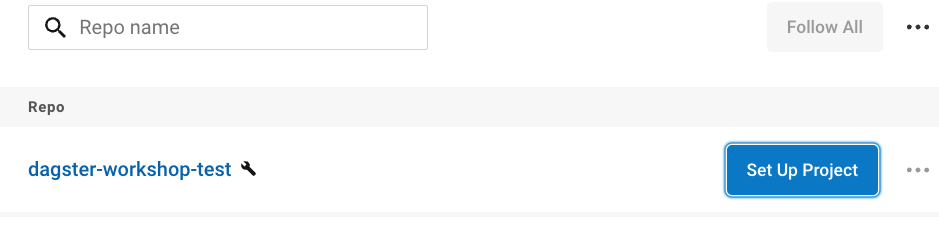
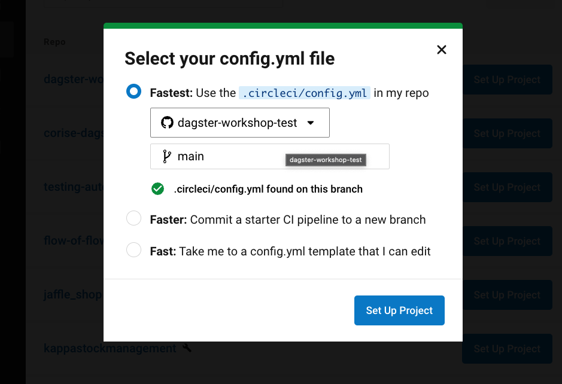

# dagster-template

Welcome to your new Dagster repository.

### Contents

| **Name**                     | **Description**                                                                       |
| ---------------------------- | ------------------------------------------------------------------------------------- |
| `.circleci/`                 | workflows of Circleci                                                                 |
| `.github/`                   | issue and pull request templates                                                      |
| `dagster/`                   | contains the code for your Dagster repositories                                       |
| `docker/`                    | A Python directory that contains code for your Dagster repository                     |
| `scripts/`                   | Utils for makefile                                                                    |
| `CHANGELOG.md`               | Log of all notable changes made for this code repository                              |
| `Makefile`                   | Automating software building procedure                                                |
| `README.md`                  | A description and guide for this code repository                                      |

### Makefile

| **Action**                | **Description**                                                         |
| ------------------------- | ----------------------------------------------------------------------- |
| **help**                  | show this help                                                          |
| **dev-deps**              | test if the dependencies we need to run this Makefile are installed     |
| **test**                  | pytest                                                                  |
| **create-env**            | create .env file                                                        |
| **start-dev**             | start the docker environment in background                              |
| **shell**                 | start the docker environment in background with shell                   |
| **start-dev-nocache**     | start the docker environment in background without cache on build       |
| **stop-dev**              | stop the the docker environment in background                           |
| **dev-clean**             | clean all the created containers                                        |
| **dev-clean-full**        | clean all the created containers and their data                         |
| **clean**                 | remove all build, test, coverage and Python artifacts                   |
| **clean-packages**        | remove build packages                                                   |
| **clean-pyc**             | remove Python pyc files                                                 |
| **clean-test**            | remove test and coverage artifacts                                      |

## 1. Requirements

- Docker
- Python ≥3.9
- [PDM](https://pdm.fming.dev/latest/#installation): using containerization, installing pdm locally is not necessary.(https://pdm.fming.dev/latest/usage/hooks/#dependencies-management)

## 2. Scenarios

1. Development
2. Cloud
### 2.1. Development

Include:
- Postgres 11
- Dagster Daemon
- Dagit

Dagster Daemon and Dagit have `dagster` folder as a docker volume.

The folder `dagster/src/` contains the code for your Dagster repository. A repository is a collection of software-defined assets, jobs, schedules, and sensors. Repositories are loaded as a unit by the Dagster CLI, Dagit and the Dagster Daemon. he repository specifies a list of items, each of which can be a AssetsDefinition, JobDefinition, ScheduleDefinition, or SensorDefinition. If you include a schedule or sensor, the job it targets will be automatically also included on the repository.

#### 2.1.1 Start environment

To start the development environment:
```bash
make start-dev
```

https://user-images.githubusercontent.com/26308855/192459452-a7eb3a7a-1b03-49e6-b901-f0b1cc41d0fc.mov

Navigate to http://127.0.0.0:3000 in your web browser.
Go to Launchpad tab. On this tab you will be able to edit job configuration. 
On the bottom right it is the "Lunch Run" execution button.

https://user-images.githubusercontent.com/26308855/192459512-d8e9141d-0443-459a-a89e-73a0189517a0.mov

#### 2.1.2 Shell

If you want to start a shell with pdm installed, ready to interact with the source projects:
```bash
make shell
```

where workdir is: `/usr/src` with folders:
- `dagster`: project
- `scripts`: utils

https://user-images.githubusercontent.com/26308855/192459555-1df66474-f8e8-41e1-a829-124591a77c9b.mov

If you want to install dev-dependencies run the utility:
```bash
./scripts/pdm-config.sh
```

https://user-images.githubusercontent.com/26308855/192459785-decd62cb-1e9d-474e-9441-3722a5c98cc3.mov

#### 2.1.3 Test

For testing (without shell):
```bash
make test
```

https://user-images.githubusercontent.com/26308855/192459713-56aec8e3-9804-49cb-9464-e9b75f00c311.mp4

As you create Dagster ops and graphs, add tests in `dagster/tests/` to check that your
code behaves as desired and does not break over time.

For hints on how to write tests for ops and graphs,
[see the documentation tutorial of Testing in Dagster](https://docs.dagster.io/tutorial/testable).

### 2.2. Cloud

We have two operating environments: sandbox and production.

CI/CD Integration with CircleCI Orb.

#### 2.2.0 Requirements

- Request Docker image on Docker Hub with the same name as your repository to #squad-platform
- Configure the project in CircleCI. Pipelines are configured in the default folder .circleci
  - Search your project https://app.circleci.com/projects/project-dashboard/github/nextail/
  - Push Set Up Project: 
  - Set the config.yml file: 
#### 2.2.1 Environments

- **Nextail Cloud**: [Link](https://nextail.dagster.cloud/)
  - Workspaces:
    - **Sandbox**: [Link](https://nextail.dagster.cloud/sandbox)
    - **Prod**: [Link](https://nextail.dagster.cloud/prod)

#### 2.2.2 Orb

The Circleci workflow lets you automatically update Dagster Cloud code locations when pipeline code is updated. The workflows builds a Docker image, pushes it to a Docker Hub repository, and uses the Dagster Cloud CLI to tell your agent to add the built image to your workspace. 

The workflows included in this template already has this worflow setup for you:

| **Workflow**                  | **Branch**   | **Description**
| ----------------------------- | ------------ | ---------------------------------------------------------------------------------------------------- |
| **unit-test**                 | all          | Execute make test (developer can change the functionality of make test)                             |
| **build-and-deploy-sandbox**  | sandbox      | Build docker image from Dockerfile, push image to DockerHub and deploy project in Dagster Sandbox    |
| **build-and-deploy-prod**     | main         | Build docker image from Dockerfile, push image to DockerHub and deploy project in Dagster Production |

[More info](https://circleci.com/developer/orbs/orb/nextail/dagster-pipelines-orb)

#### 2.2.3 Permissions

The template provided for development provides an integration with Dagster Cloud that omits any type of requirement of a service account for the deployment.

For the executions we use an Amazon Service Account "user-cloud-dagster-cloud-agent" as default, which has basic permissions for the execution of jobs such as:

- **Amazon S3**: The default Service Account has permissions over the following paths:
  - For **evo** pipelines (should be everything):
     - SANDBOX:
       - nextail-dev-evo/dagster/{{your_path}}:
          ```
          s3_bucket: nextail-{{tenant}}-evo
          s3_prefix: env-sandbox/{{tenant}}/dagster/{{your_path}}
          ```

    - PRODUCTION:
      - nextail-{{tenant}}-evo/dagster/{{your_path}}:
          ```
          s3_bucket: nextail-{{tenant}}-evo
          s3_prefix: dagster/{{your_path}}
          ```
  - For **no evo** pipelines:
     - SANDBOX:
       - nextail-dev/dagster/{{your_path}}:
          ```
          s3_bucket: nextail-dev
          s3_prefix: env-sandbox/{{tenant}}/dagster/{{your_path}}
          ```

    - PRODUCTION:
      - nextail-{{tenant}}/dagster/{{your_path}}:
          ```
          s3_bucket: nextail-{{tenant}}
          s3_prefix: dagster/{{your_path}}
          ```

- **Amazon Secrets Manager**: access to Secrets containing the following tags
   - "scope-dagster": "true"
   - "dagger": ""
   - "environment": "${environment}" (where environment could be sandbox or production)
- **K8s**: running jobs on Kubernetes in the environment that corresponds to it.

If for the execution of your pipelines you need more permissions or change any of the existing ones, it will be necessary to create a specific Amazon Service Account for your repository.
Contact #squad-platform for the request.
