# Nextail Costs Data Pipeline


Welcome to the Nextail Costs Data Pipeline documentation. This project implements a **modern data architecture for ingesting and processing costs related to our cloud infrastructure**; more specifically, it's used to track and analyze the costs associated to our Kubernetes and Snowflake resources.

This project is a _Proof of Concept (PoC)_ that demonstrates:

- How to collect cost data from multiple sources (Kubecost data already ingested as Snowflake External Tables pointing to files in S3, and Snowflake Query Attribution History view)
- How to process it by using a standard dbt project with a medallion architecture (bronze/staging + silver + gold)
- How to make it available for dashboards (Metabase, in our case)

```mermaid
graph LR
    %% Data Sources
    subgraph "📊 Sources"
        KUBECOST[Kubecost<br/>K8s Costs]
        SNOWFLAKE[Snowflake<br/>Query Attribution]
    end

    %% Load Phase
    subgraph "📥 Load"
        L1[Snowflake<br/>Raw Tables]
    end

    %% Transform Phase
    subgraph "🔄 Transform"
        T1[dbt<br/>Models]
    end

    %% Output
    subgraph "📈 Output"
        O1[Analytics<br/>Tables]
        O2[Dashboards<br/>Reports]
    end

    %% Connections
    KUBECOST --> L1
    SNOWFLAKE --> L1
    
    L1 --> T1
    T1 --> O1
    O1 --> O2

    %% Styling
    classDef sourceStyle fill:#e1f5fe,stroke:#01579b,stroke-width:2px
    classDef loadStyle fill:#e8f5e8,stroke:#1b5e20,stroke-width:2px
    classDef transformStyle fill:#fff3e0,stroke:#e65100,stroke-width:2px
    classDef outputStyle fill:#f1f8e9,stroke:#33691e,stroke-width:2px

    class KUBECOST,SNOWFLAKE sourceStyle
    class L1 loadStyle
    class T1 transformStyle
    class O1,O2 outputStyle
```



The goal is to prove this approach works before expanding it to more data sources or teams, if applicable. Also, having a unique dbt repository for this project helps us to keep the codebase clean and easy to maintain. We can add additional dbt sources and models for other projects in the future.

## 🚀 Quick Start

### Running the project

```bash
# 1. Clone and setup
git clone -b sandbox https://github.com/nextail/nx-dbt.git
cd nx-dbt

# 2. Start development environment
make start-dev

# 3. Access Dagster UI
# Open: http://127.0.0.1:3000

# 4. Stop the development environment
make stop-dev
```

For updating the codebase without having to execute the `make start-dev`, you can go to your Dagster UI > Deployment > Click on the `Redeploy` buttonm (right side of the screen).

### Modifying dbt models

1. Go to the `dbt_project/models` folder
2. Make your changes
3. Run `dbt run` to run the models

Please, note you will need your own python virtual environment with the dependencies (depicted in the `pyproject.toml` file) installed, and the following environment variables set in your computer:

```bash
export DBT_RSA_PASSPHRASE="XXXXX" # it's available in LastPass
export DBT_RSA_KEY=$(cat <path_to_your_key>/dbt_rsa_key.p8) # contents available in LastPass
export DBT_TARGET="nx_internal_sandbox"
export NX_ENVIRONMENT="SANDBOX"
```

It is recommended to set these environment variables in your `.zshrc` file, so you don't have to set them every time you open a new terminal.

You should be using the specific key and passphrase for the dbt user we've created for this PoC. For further details, please contact the Data Platform Team (hint: they are in LastPass).

Bear in mind these variables are specific to the sandbox environment and they might change in the future. To ensure you have the correct configuration, you can run `dbt debug` to check the connection to Snowflake is working.

### Adding new Dagster jobs and schedules

Dagster is used to orchestrate the data pipeline and the dbt run executions. We have created a general asset (`nx_internal_reporting_full`) that includes the whole dbt project with all the models; then, we subset the dbt executions by creating different schedules for each subset of models, by using [dbt subsetting of nodes](https://docs.getdbt.com/reference/node-selection/syntax#shorthand) (i.e.: the `costs.*` in `dbt run --select costs.*`).


In this Proof of Concept (PoC), we have set up a few jobs and schedules to run the data pipeline. For example:

| Component | File Location | Description | Schedule |
|-----------|---------------|-------------|----------|
| `nx_internal_reporting_full` asset | `nx_dbt/dagster/jobs/assets.py` | Includes the whole dbt project with all the models | - |
| `dbt_costs_materialization_schedule` | `nx_dbt/dagster/jobs/schedules.py` | Runs the costs models (`fqn:costs.*`) | Every 12 hours |
| `dbt_internal_materialization_schedule` | `nx_dbt/dagster/jobs/schedules.py` | Runs the internal models (`fqn:internal.*`) | Daily at 05:00 UTC |
| `dbt_snowflake_query_attribution_schedule` | `nx_dbt/dagster/jobs/schedules.py` | Runs the snowflake query attribution models (`fqn:stg_query_attribution_history`) | Every 4 hours |

To add a new job and schedule, you can follow the examples in the `nx_dbt/dagster/jobs/assets.py` and `nx_dbt/dagster/jobs/schedules.py` files, bearing in mind the following:
- The `nx_internal_reporting_full` asset is the main asset that includes the whole dbt project with all the models.
- You can create a new schedule that will run dbt in a certain subset of models; i.e.: `fqn:costs.*` or `fqn:internal.*` or `fqn:stg_query_attribution_history` are equivalent to `dbt run --select costs.*` or `dbt run --select internal.*` or `dbt run --select stg_query_attribution_history`.
- It is recommended to test these changes first locally, and then in the sandbox environment.

## 📈 Monitoring & Health

### **Check Pipeline Health**
- **Dagster UI**: http://127.0.0.1:3000 (local) or https://nextail.dagster.cloud/sandbox/locations/nx-dbt-default/ (Cloud-Sandbox)
- **Catalog Tab > Assets**: See which data is fresh (last updated) in https://nextail.dagster.cloud/sandbox/selection/all-assets/assets?asset-selection=kind%3A%22dbt%22
- **Runs Tab**: Check for failed jobs ([direct link for costs materialization](https://nextail.dagster.cloud/sandbox/runs?q%5B0%5D=job:dbt_costs_materialization_job); there are a few more materialization jobs for the other models)
- **Automation Tab** ([link](https://nextail.dagster.cloud/sandbox/automation)): for verifying schedules are running

> **Note**: Slack notifications on dbt tests errors are not developed yet. Furthermore, the Dagster pipelines are executing only `run` commands, not `build` commands, hence the tests are not included at this moment.

## 📊 Data Quality

dbt can handle [data tests](https://docs.getdbt.com/docs/build/data-tests) to ensure the data is correct and consistent. In the scope of this PoC, we have created a few data tests to ensure the data is correct and consistent, but they are not included in the Dagster pipelines at this moment.

Do check the current data tests available within this dbt project, search for the `_<model_name>_tests.yml` files in the `dbt_project/models` folder. You can run them locally by running `dbt test` in the `dbt_project` folder.

## Data Visualization

The visualization tool associated to this PoC is Metabase. You can access it at https://nextail-metabase.internal.unstable.nextail.co/ (sandbox). It is available only under a VPN connection.

A public link of a sample dashboard can be accessed at https://nextail-metabase.internal.unstable.nextail.co/public/dashboard/020363a7-8193-408c-b658-8b4dc21df661. It does not require any authentication, apart from the VPN connection.


## 🆘 Getting Help

### **Team Support**
- **Data Platform Team**: For technical issues and questions
- **Platform Squad**: For infrastructure and deployment issues

### **External Resources**
- **Dagster Docs**: https://docs.dagster.io/
- **dbt Docs**: https://docs.getdbt.com/
- **Snowflake Docs**: https://docs.snowflake.com/

## 📝 Quick Reference

### **Environment URLs**
| Environment | Dagster UI | Purpose |
|-------------|------------|---------|
| **Local** | http://127.0.0.1:3000 | Development |
| **Sandbox** | https://nextail.dagster.cloud/sandbox | Testing |
| **Production** | https://nextail.dagster.cloud/production | Live |

### **Key Files**
| File | Purpose |
|------|---------|
| `nx_dbt/dagster/jobs/assets.py` | Main dbt asset definition |
| `nx_dbt/dagster/jobs/schedules.py` | Automation schedules |
| `dbt_project/models/` | SQL transformation models |
| `dbt_project/dbt_project.yml` | dbt configuration |
